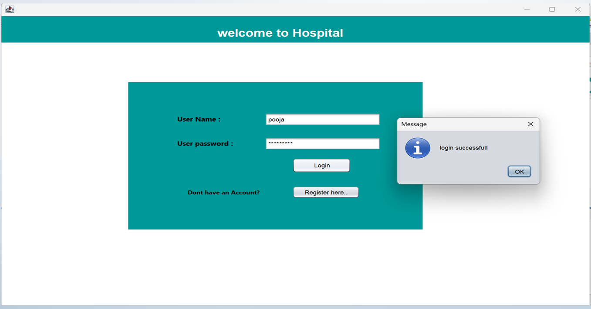
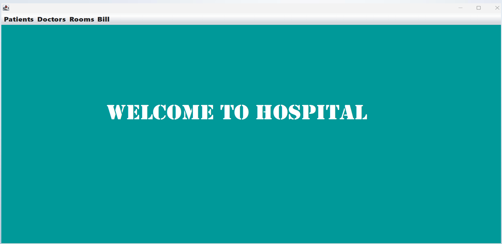

# 🏥 Hospital Management System (HMS)

## 📌 Project Overview

Hospital Management System is a desktop-based application developed to manage hospital operations digitally. It helps in managing doctors, patients, admissions, discharges, billing, and records efficiently.

The project reduces manual paperwork and provides an organized way to maintain hospital information.

---

## ✨ Features

- 👨‍⚕️ Add & View Doctor Details
- 🧑 Add & Manage Patient Records
- 🏥 Patient Admission Management
- 🚪 Patient Discharge Management
- 💳 Billing Management
- 📋 View Doctor & Patient Records

---

## 🛠️ Technologies Used

- Java
- Java Swing
- MySQL
- JDBC
- NetBeans IDE
- Git & GitHub

---

## 🗂️ Modules

- Doctor Management
- Patient Management
- Admission & Discharge
- Billing System
- Database Management

---

## 📸 Screenshots

### Login Page

### Dashboard

### Add Doctor

### Add Patient

### Billing

---

## 🗄️ Database

MySQL database is used to store:

- Doctor Details
- Patient Information
- Admission Records
- Discharge Records
- Billing Details

Database file:
database/hospital.sql

---

## ⚙️ How to Run

1. Open project in NetBeans IDE  
2. Import `hospital.sql` database in MySQL  
3. Configure database connection  
4. Run the application  

---

## 🚀 Future Enhancements

- Online appointment booking
- Patient login portal
- Medical report management
- Advanced analytics dashboard

---

## 👩‍💻 Author

**Pooja Chavan**

BCA Graduate | Java Developer | Data Analytics Learner

Skills:
Java • MySQL • SQL • Python • Excel • Power BI • Git

GitHub:
https://github.com/poojachavan8225
